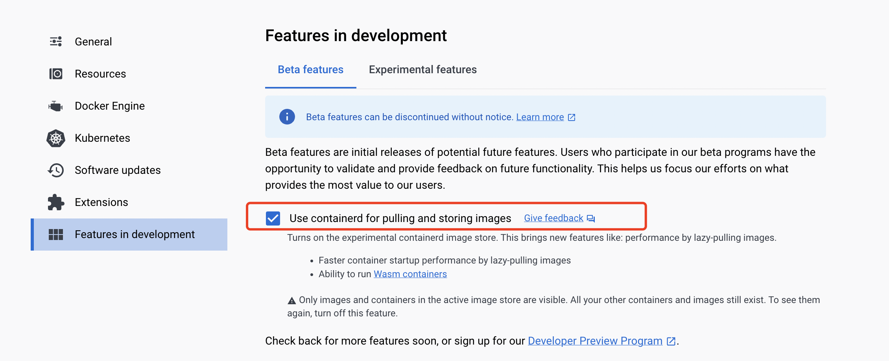

# Quick start with Docker

In this guide, we will walk you through how to quickly run WasmEdge apps in Docker Desktop. There is no additional dependencies as the entire development and runtime environments are managed by Docker Desktop.

> If you are not using Docker Desktop, [get started here](quick_start).

We will cover the following examples.

* [Run a standalone Wasm app](#run-a-standalone-wasm-app)
* [Run an HTTP server](#run-an-http-server)
* [Run a JavaScript server (node.js)](#run-a-javascript-based-server)

In this quick start guide, we cover how to run Wasm container apps using Docker commands. If you are interested in how to build, publish, and compose Wasm container apps from source code, check out the [Docker + wasm chapter](../build-and-run/docker_wasm).

## Prerequisite

You must have Docker Desktop 4.15+ installed. 
Make sure you have turned on the containerd image store feature in your Docker Desktop. 



## Run a standalone Wasm app

The Hello world example is a standalone Rust application. Its source code and build instructions are available [here](https://github.com/second-state/rust-examples/tree/main/hello).

Use Docker to run the containerized Wasm app. The Wasm container image is stored in Docker Hub, and its image size is only 500KB. This image can run on any OS and CPU platform Docker supports.

```bash
$ docker run --rm --runtime=io.containerd.wasmedge.v1 --platform=wasi/wasm secondstate/rust-example-hello:latest
Hello WasmEdge!
```

To learn more about how to create Wasm apps in Rust

* [Basic Rust examples for WasmEdge](https://github.com/second-state/rust-examples)
* [Rust developer guides](../../category/develop-wasm-apps-in-rust)
  * AI inference with PyTorch and Tensorflow
  * HTTP and HTTPS client
  * MySQL database client
  * Redis client
  * Kafka client

## Run an HTTP server

This example is a standalone HTTP server written in Rust. It demonstrates that Rust + WasmEdge as a lightweight stack for microservices. Its source code and build instructions are available [here](https://github.com/second-state/rust-examples/tree/main/server).

Use Docker to pull the container image (around 800KB) from Docker Hub and then run it in a WasmEdge container. The container starts as a server. Note how we map the container's port 8080 to the local host's port 8080 so that the server becomes accessible from outside of the Wasm container.

```bash
$ docker run -dp 8080:8080 --rm --runtime=io.containerd.wasmedge.v1 --platform=wasi/wasm secondstate/rust-example-server:latest
Listening on http://0.0.0.0:8080
```

From another terminal window, do the following.

```bash
$ curl http://localhost:8080/
Try POSTing data to /echo such as: `curl localhost:8080/echo -XPOST -d 'hello world'`

$ curl http://localhost:8080/echo -X POST -d "Hello WasmEdge"
Hello WasmEdge
```

To learn more about how to create Wasm services in Rust

* [Rust developer guides](../../category/develop-wasm-apps-in-rust)
* [HTTP application examples](https://github.com/WasmEdge/wasmedge_hyper_demo)
* [Database application examples](https://github.com/WasmEdge/wasmedge-db-examples)
* Lightweight microservices in Rust and WasmEdge
  * [WasmEdge + Nginx + MySQL](https://github.com/second-state/microservice-rust-mysql)
  * [WasmEdge + Kafka + MySQL](https://github.com/docker/awesome-compose/tree/master/wasmedge-kafka-mysql)
  * [Dapr + WasmEdge](https://github.com/second-state/dapr-wasm)

## Run a JavaScript-based server

This example is a standalone HTTP server written in JavaScript using the node.js API. It demonstrates WasmEdge as a lightweight runtime for zero-dependency and portable node.js applications.
Its source code is available [here](https://github.com/second-state/wasmedge-quickjs/tree/main/example_js/docker_wasm/server).

```bash
$ docker run -dp 8080:8080 --rm --runtime=io.containerd.wasmedge.v1 --platform=wasi/wasm secondstate/node-example-server:latest
... ...
```

From another terminal window, do the following.

```bash
$ curl http://localhost:8080/echo -X POST -d "Hello WasmEdge"
Hello WasmEdge
```

To learn more about how to run JavaScript apps in WasmEdge.

* [The WasmEdge QuickJS runtime](https://github.com/second-state/wasmedge-quickjs)
* [AI inference application examples](https://github.com/second-state/wasmedge-quickjs/tree/main/example_js/tensorflow_lite_demo)
* [Web service client examples with fetch()](https://github.com/second-state/wasmedge-quickjs/blob/main/example_js/wasi_http_fetch.js)

## Next steps

* [Learn more about building and managing Wasm containers in Docker](../build-and-run/docker_wasm)
* [Basic Rust examples for WasmEdge](https://github.com/second-state/rust-examples)
* [Rust developer guides](../../category/develop-wasm-apps-in-rust)
* Use Docker Compose to build and Rust-based microservices
  * [WasmEdge / MySQL / Nginx](https://github.com/docker/awesome-compose/tree/master/wasmedge-mysql-nginx) - Sample Wasm-based web application with a static HTML frontend, using a MySQL (MariaDB) database. The frontend connects to a Wasm microservice written in Rust, that runs using the WasmEdge runtime.
  * [WasmEdge / Kafka / MySQL](https://github.com/docker/awesome-compose/tree/master/wasmedge-kafka-mysql) - Sample Wasm-based microservice that subscribes to a Kafka (Redpanda) queue topic, and transforms and saves any incoming message into a MySQL (MariaDB) database.
* Write Wasm apps in your favorite languages, like [Rust](../../category/develop-wasm-apps-in-rust), [C/C++](../../category/develop-wasm-apps-in-cc), [JavaScript](../../category/developing-wasm-apps-in-javascript), [Go](../../category/develop-wasm-apps-in-go), and many other languages.
